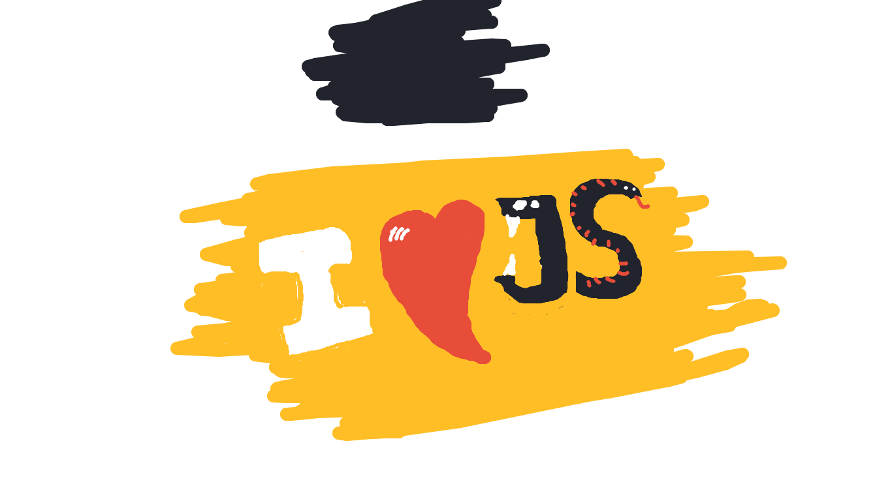
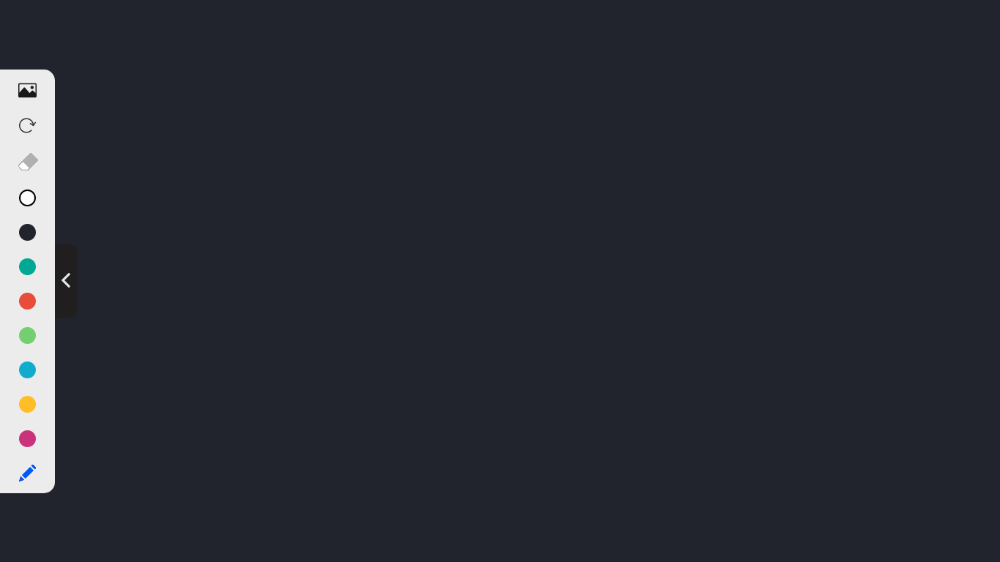
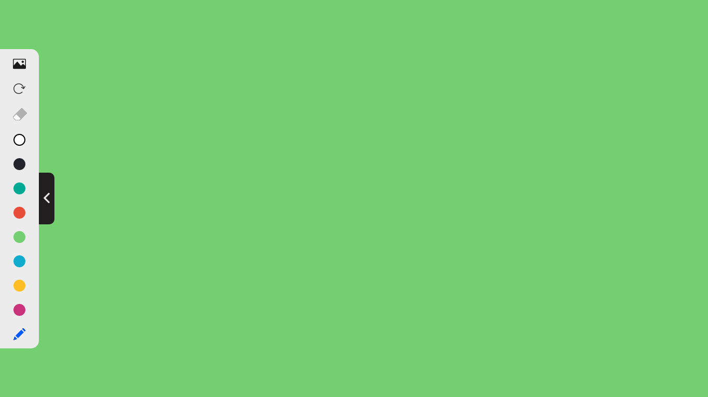
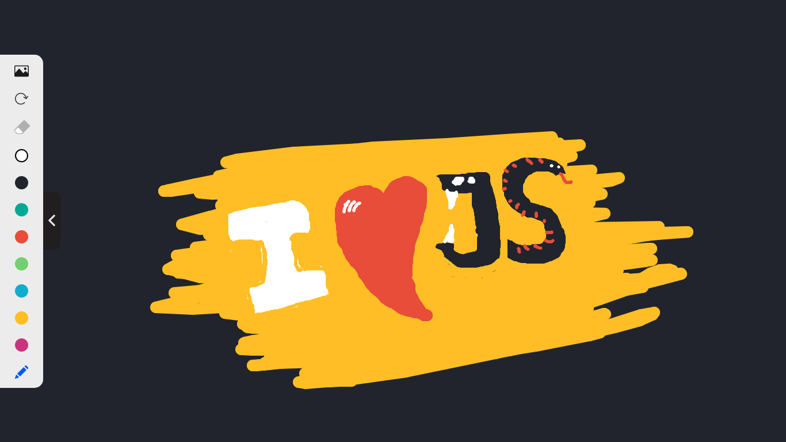
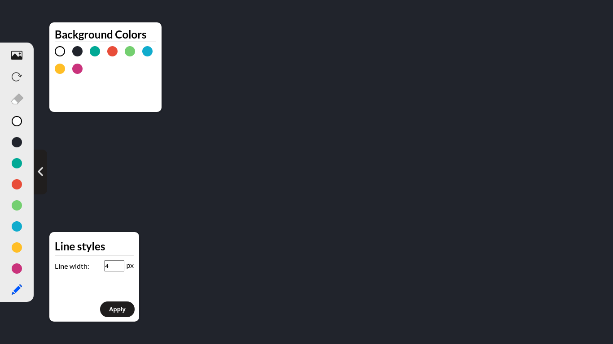

# Paint - Khan Academy

A simple khan academy question modal like painting canvas.

## Requirements
> Python 3+ installed

> Any modern web browser.

## Installation
Open terminal and run the following commands:
> `git clone https://github.com/Muhammed-Rajab/Paint.git`

> `cd 'Paint'`

> `chmod +x run.sh`

> `./run.sh`

Technologies Used:

* HTML
* CSS
* Vanilla JS

Features:

* Multiple background colors
* Simple UI
* Easy for Basic Usage

Features needed to add:

* Erase button (Added to UI but not functional)
* Grids
* Custom Color
* More line options

## Screenshots

